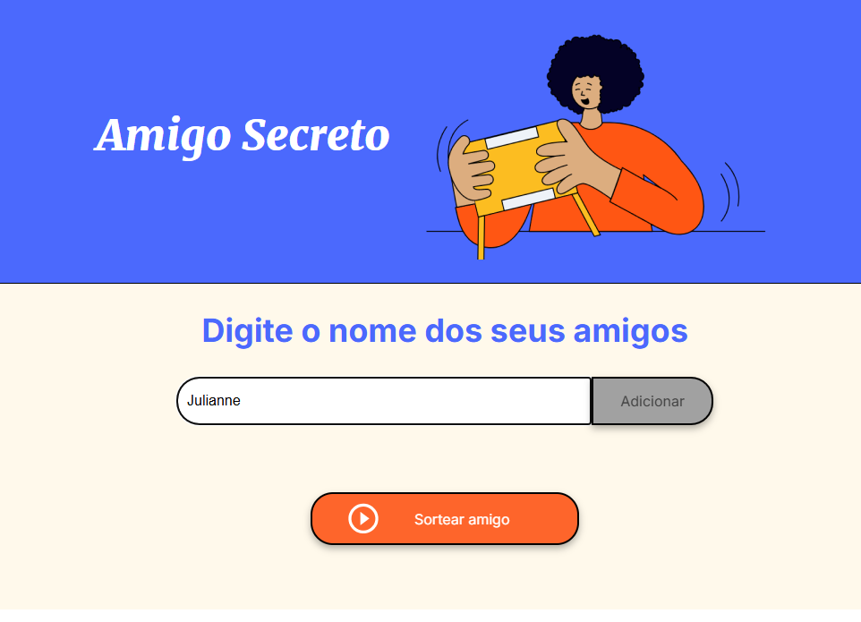
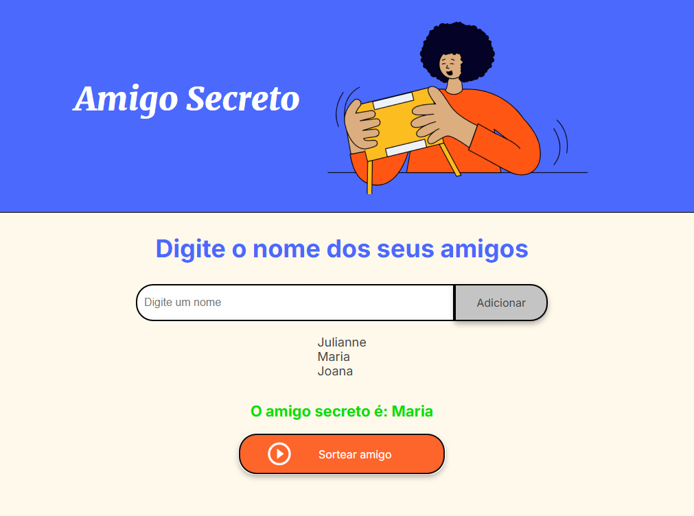

#desafio-amigo-secreto-alura

# 🎁 Amigo Secreto

Um projeto simples para realizar sorteios de amigo secreto, permitindo adicionar nomes a uma lista e sortear um participante aleatoriamente.

## 🚀 Funcionalidades

- Adicionar nomes à lista.
- Exibir os nomes adicionados.
- Sortear aleatoriamente um amigo secreto.
- Interface amigável e intuitiva.

## 📷 Capturas de Tela

### Adicionando nomes


### Sorteando um amigo secreto


## 🎥 Demonstração em Vídeo

https://youtu.be/i2uFgVRYl9I

## 🛠️ Tecnologias Utilizadas

- HTML
- CSS
- JavaScript

## 🎯 Como Usar

1. Clone este repositório:
   ```sh
   git clone https://github.com/seu-usuario/amigo-secreto.git
